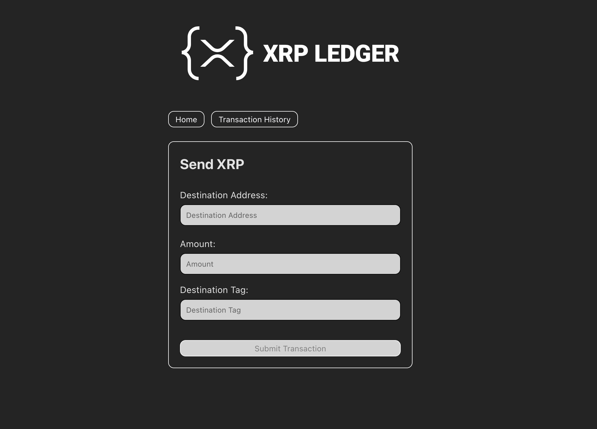

# Pre-requisites

1. [Node.js](https://nodejs.org/en/download/) (v10.15.3 or higher)
2. Install [Yarn](https://yarnpkg.com/en/docs/install) (v1.17.3 or higher) or [NPM](https://www.npmjs.com/get-npm) (v6.4.1 or higher)
3. Add your Seed, Client, and specify testnet/mainnet in .env file - see [example.env](example.env)
4. Run `yarn install` to install dependencies
5. Start the app with `yarn dev` or `npm dev`

# Wallet Details

This wallet application is a simple example of how to build a wallet using [xrpl.js](https://js.xrpl.org) and the [XRP Ledger WebSocket API](https://xrpl.org/websocket-api-tool.html). It is not intended to be used in production.

# Screenshots

# Features

## Home Page

When you run `yarn dev` or `npm dev`, the app will start and connect to the XRP Ledger. Account details will be displayed on the home page including the account's address, balance, reserve and X-Address. 
Ledger details will refresh automatically every 4 seconds (approx close time of the ledger). 

You can navigate to the Send page to send XRP to another account or to the Transactions page to view the latest transactions for the account.

## Sending XRP

On the Send page, you can send XRP to another account. You can enter the destination address, amount and a destination tag. The tag is optional and can be any string. 

When you click the Send button, the app will submit a payment transaction to the XRP Ledger. The transaction will be signed using the secret key for the account.

On success, a prompt will appear and you can click the transactions button on the top of the page to view the transaction.

## Transactions Page

The Transactions page displays the latest transactions for the account. The transactions are fetched from the XRP Ledger using the [account_tx](https://xrpl.org/account_tx.html) method.

The transactions are displayed in a table with the following columns:

- Account
- Fee (XRP)
- Amount
- Transaction Type
- Result
- Link

The Account column displays the account that sent the transaction. The Fee column displays the transaction fee in XRP. The Amount column displays the amount of XRP sent or received. The Transaction Type column displays the type of transaction. The Result column displays the result of the transaction. The Link column displays a link to the raw data of transaction.

## Notes

- The app uses the [XRP Ledger Test Net](https://xrpl.org/xrp-test-net-faucet.html) by default. To use the mainnet, change the `XRPL_NETWORK` variable in the .env file to `mainnet`.
- The app uses the [XRP Ledger WebSocket API](https://xrpl.org/websocket-api-tool.html) to connect to the XRP Ledger. The WebSocket API is a convenient way to connect to the XRP Ledger and subscribe to account notifications. 
- The app uses the [account_tx](https://xrpl.org/account_tx.html) method to fetch the latest transactions for the account. 
- The app uses the [account_info](https://xrpl.org/account_info.html) method to fetch the account details.
- The app uses [xrpl.js](https://js.xrpl.org) to sign transactions and submit them to the XRP Ledger.