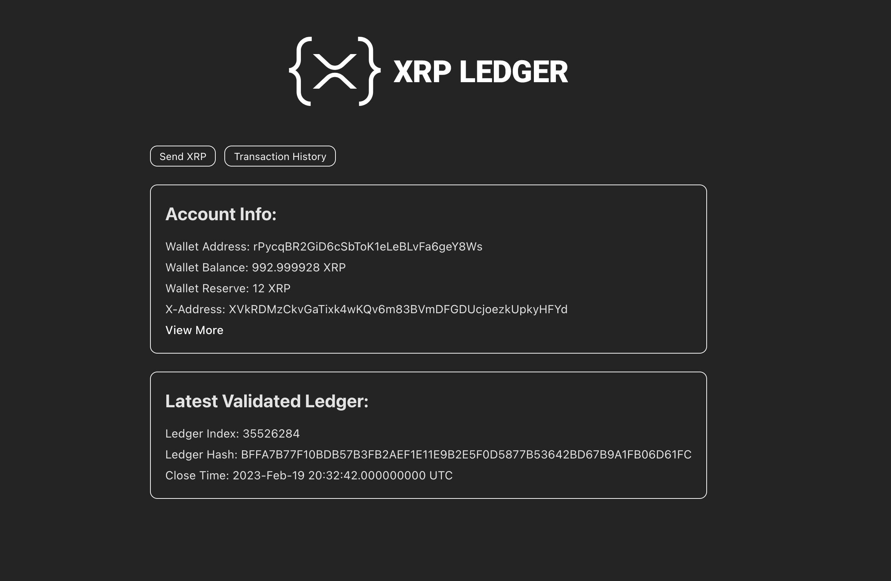
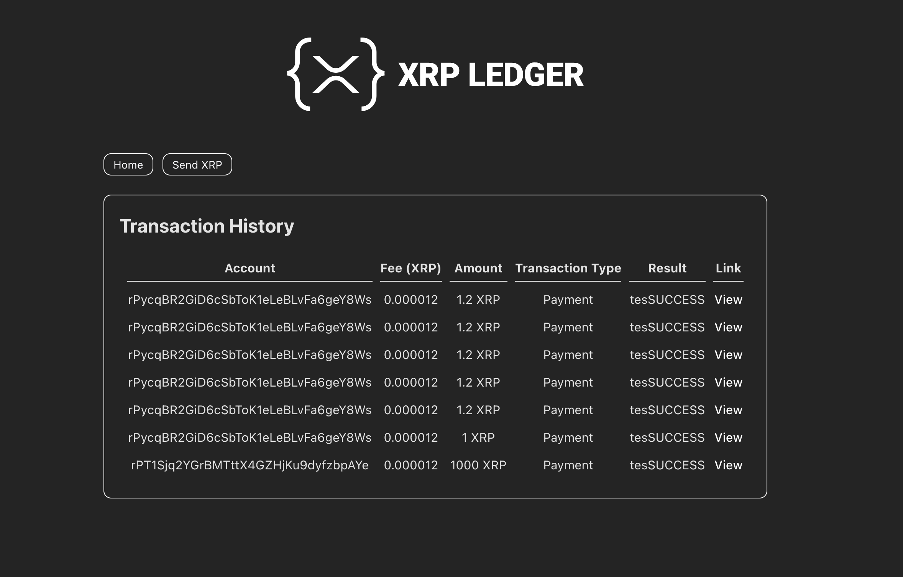

# Pre-requisites

To implement this tutorial you should have a basic understanding of JavaScript and Node.js. You should also have a basic idea about XRP Ledger. For more information, visit the [XRP Ledger Dev Portal](https://xrpl.org) and the [XRPL Learning Portal](https://learn.xrpl.org/) for videos, libraries, and other resources.

Follow the steps below to get started:

1. [Node.js](https://nodejs.org/en/download/) (v10.15.3 or higher)
2. Install [Yarn](https://yarnpkg.com/en/docs/install) (v1.17.3 or higher) or [NPM](https://www.npmjs.com/get-npm) (v6.4.1 or higher)
3. Add your Seed, Client, and specify testnet/mainnet in .env file - see [example.env](example.env)
4. Run `yarn install` or `npm install` to install dependencies
5. Start the app with `yarn dev` or `npm dev`

# Goals

At the end of this tutorial, you should be able to build a simple XRP wallet that is displayed in the screenshot section.

This application is capable of the following:

- Shows updates to the XRP Ledger in real-time.
- Can view any XRP Ledger account's activity "read-only" including showing how much XRP was delivered by each transaction.
- Shows how much XRP is set aside for the account's reserve requirement. 
- Can send direct XRP payments, and provides feedback about the intended destination address, including:
  - Displays available balance in your account
  - Verifies that the destination address is valid
  - Validates amount input to ensure it is a valid number and that the account has enough XRP to send
  - Allows addition of the destination tag
# Screenshots

